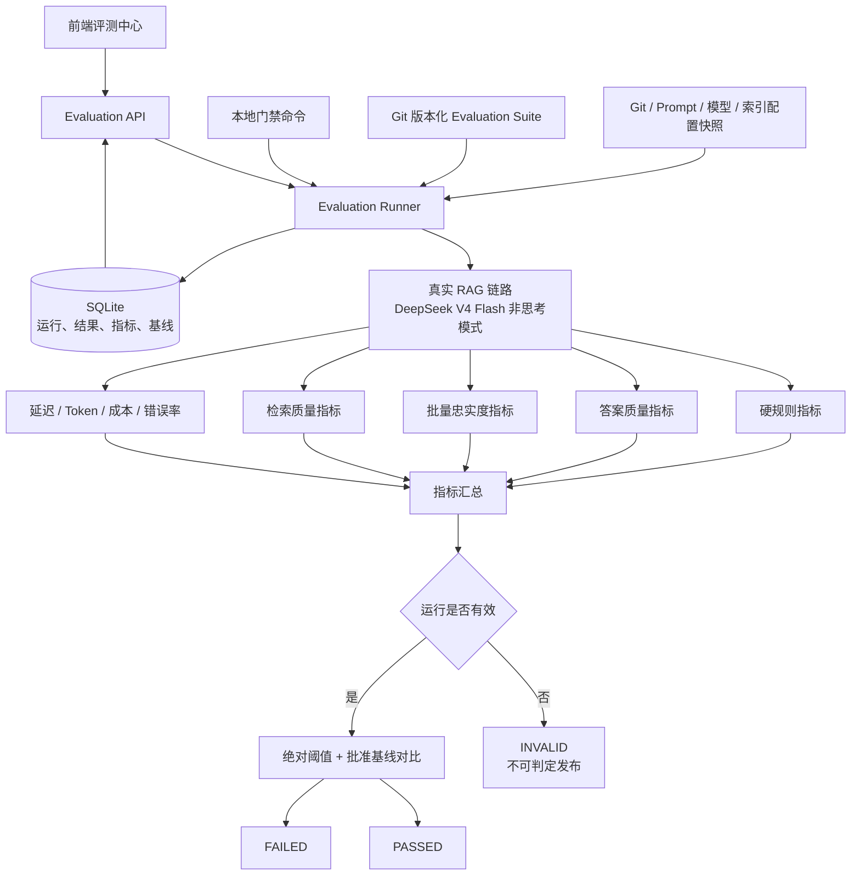
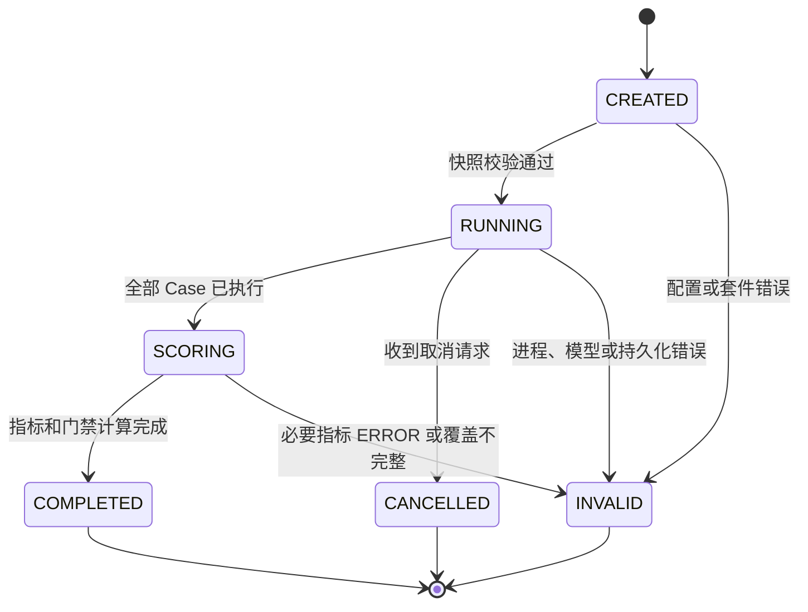

# RAG 企业内部发布门禁设计

日期：2026-08-05

状态：已确认，待实施计划

范围：KingIAsk RAG 评测中心第一阶段

## 1. 目标与背景

当前系统已经具备单轮/多轮用例、关键词与来源规则、图片与拒答检查、忠实度评测、SQLite 历史记录、运行对比、质量门禁和前端评测中心。现阶段的主要问题不是缺少页面，而是评测结果尚不足以作为发布依据：关键词容易误判，忠实度未参与门禁，Judge 失败会被静默跳过，运行缺少完整快照，前端可以回传评分结果，且没有稳定的批准基线。

第一阶段目标是建设一个供研发团队使用的内部发布门禁：代码、Prompt、检索配置或知识库变化后，通过本地命令或前端启动真实 RAG 评测，并基于绝对阈值和批准基线判断是否建议发布。

第一阶段不引入外部 CI/CD 平台。系统提供稳定的本地命令和退出码，未来可被 GitHub Actions、GitLab CI 或 Jenkins 直接复用。

## 2. 已确认的设计决策

1. 采用模块化升级现有评测中心，不推翻现有 Vue、FastAPI 和 SQLite 技术栈。
2. RAG 回答、Query Rewrite、对话改写、摘要和 Judge 全部使用 `deepseek-v4-flash`。
3. 所有评测相关模型调用显式关闭思考模式，并限制输出长度。
4. 第一版使用 20 条人工审核的 `core` 用例，不依赖真实用户日志。
5. 关键词降级为少量硬规则；答案正确性使用参考答案、关键事实和 Flash Judge 判断。
6. 门禁同时检查绝对阈值和相对批准基线的退化。
7. 先运行 3-5 次校准评测，批准首个基线后再启用阻断模式。
8. 后端 Runner 是唯一可信执行和评分方；前端只能创建、取消和读取运行。
9. Judge 或基础设施失败属于无效运行，不得当作质量低分或默认通过。
10. 真实问题采集、脱敏和转评测用例作为第二阶段能力预留。

## 3. 总体架构



### 3.1 模块边界

- `SuiteLoader`：加载、校验和版本化评测套件；计算套件内容哈希。
- `RunSnapshotBuilder`：冻结 Git、模型、Prompt、索引、检索和运行环境信息。
- `EvaluationRunner`：控制运行状态、逐条执行、取消、安全落库和汇总。
- `MetricEvaluator`：运行确定性指标和 Judge 指标，返回通用 `MetricResult`。
- `GateEvaluator`：先判断运行有效性，再执行绝对门禁和基线退化门禁。
- `BaselineService`：批准和读取不可修改的基线记录。
- `EvaluationRepository`：保存运行、用例、轮次、通用指标和基线。
- `Evaluation API/CLI`：作为两个入口复用同一个 Runner，不复制判分逻辑。

## 4. 评测套件与用例

### 4.1 Suite

评测资产以 Git 中的 JSON 文件为事实来源。第一版文件建议为：

```text
backend/evaluation_cases/core.v1.json
```

Suite 至少包含：

```json
{
  "id": "core",
  "version": "1.0.0",
  "description": "KingIAsk 核心发布门禁集",
  "default_thresholds": {
    "answer_correctness": 0.8,
    "faithfulness": 0.9,
    "p1_required_fact_coverage": 0.8
  },
  "cases": []
}
```

Runner 在运行开始时计算 `cases_hash`。同一个 Suite ID 的内容发生变化时必须提升版本，或至少产生不同哈希；不同哈希的运行不能被当作完全等价的回归结果。

### 4.2 Case

```json
{
  "id": "single.collect.create",
  "category": "数采管理",
  "priority": "P0",
  "tags": ["single", "workflow"],
  "question": "如何创建采集工程？",
  "reference_answer": "进入数采管理，新建工程并填写工程名称。",
  "required_facts": [
    {
      "id": "entry",
      "text": "从数采管理进入工程创建入口",
      "required": true
    },
    {
      "id": "name",
      "text": "创建时需要填写工程名称",
      "required": true
    }
  ],
  "keyword_anchors": ["数采管理"],
  "forbidden_facts": ["从数据APP组态创建采集工程"],
  "expected_source_ids": ["工程开发-Windows"],
  "expected_chunk_ids": [],
  "expect_no_answer": false,
  "expect_images": false,
  "min_sources": 1
}
```

多轮用例使用 `turns`，每一轮可以独立定义 `reference_answer`、`required_facts` 和检索真值。用例 ID 必须稳定且全局唯一。

### 4.3 第一版 20 条用例分布

- 8 条核心业务流程。
- 3 条多轮追问。
- 3 条无答案或正确拒答。
- 2 条相似概念或错误来源干扰。
- 2 条口语、错别字或同义改写。
- 2 条越界或 Prompt 注入基础用例。

一期不自动生成正式门禁用例。可以用模型辅助起草，但进入 `core` 前必须人工审核参考答案、关键事实和来源真值。

### 4.4 旧用例迁移

现有 `expected_keywords` 和 `expected_keyword_groups` 不直接删除：

- 不可替换的产品名、按钮名、命令和参数迁移到 `keyword_anchors`。
- 表达某个业务含义的关键词组迁移到 `required_facts`。
- 来源路径关键词迁移到稳定的 `expected_source_ids` 或 `expected_chunk_ids`。
- 未经人工审核的旧用例可以被兼容读取，但不能进入正式 `blocking` 套件。

## 5. 指标设计

### 5.1 通用指标结果

所有指标统一返回：

```text
MetricResult
  name: str
  score: float | null
  status: PASSED | FAILED | ERROR | SKIPPED
  threshold: float | null
  details: object
  elapsed_ms: float
  token_usage: object | null
  error_code: str | null
```

`ERROR` 不等于 `FAILED`。前者表示本次运行无法形成可信质量结论；后者表示系统真实输出未满足质量要求。

### 5.2 硬规则

- `keyword_anchor_passed`：只检查答案正文，不再把来源片段拼入答案。
- `forbidden_fact_passed`：禁止出现确定性错误或危险指令。
- `no_answer_passed`：该回答或拒答是否符合预期。
- `image_passed`：需要图片的场景是否满足数量要求。
- `source_count_passed`：来源数量是否达到最低要求。

硬规则不得与其他高分互相补偿。任何必要硬规则失败都会让 Case 失败。

### 5.3 答案质量

使用 Flash 非思考模式，在一次 JSON 调用中比较问题、参考答案、关键事实和实际答案，输出：

- `answer_correctness`：答案整体是否正确。
- `answer_relevance`：是否直接回应问题，避免无关内容。
- `required_fact_coverage`：逐项判断关键事实是否覆盖，并返回缺失事实 ID。
- `forbidden_fact_matches`：逐项判断是否表达了禁止事实。

Judge 的输出必须经过 Pydantic Schema 校验。缺字段、非法 JSON 或无法解析时有限重试；仍失败则指标为 `ERROR`。

### 5.4 忠实度

当前逐 claim 单独请求的方式改为单次批量 Judge：输入答案和召回片段，要求模型拆分 claims，并为每个 claim 同时返回 `supported` 和证据。

输出包括：

- `faithfulness_score`：受支持 claim 数 / 已判断 claim 数。
- `claims`：claim、supported、evidence。
- `hallucinated_claims`：所有未得到证据支持的声明。

非拒答回答没有可评测 claim、Judge 未覆盖全部 claims 或上下文缺失时，不允许静默跳过。系统根据场景标记 `ERROR` 或明确的 `SKIPPED`，并将有效覆盖率纳入运行有效性检查。

### 5.5 检索质量

检索指标使用稳定的 source/chunk ID：

- `Hit@K`：Top K 是否至少命中一个正确来源。
- `Recall@K`：期望来源中被召回的比例。
- `MRR`：第一个正确来源排名的倒数。
- `forbidden_source_matches`：是否召回明确禁止的来源。

P0 Case 必须命中至少一个期望来源。Suite 汇总展示平均 Recall@K 和 MRR。第一阶段默认 K 使用实际 RAG `top_k`，并在快照中记录。

### 5.6 系统与成本指标

- RAG 总耗时和每轮耗时。
- 检索、生成、Judge 各阶段耗时。
- P50、P95、最大耗时。
- 模型请求数、输入 Token、输出 Token、缓存命中 Token。
- RAG 与 Judge 的估算费用。
- 模型调用错误率和 Judge 有效覆盖率。

单轮和多轮耗时分开汇总，避免把不同粒度混成一个 P95。

## 6. Case 与 Run 判定

### 6.1 Case 判定

第一版默认规则：

- 所有必要硬规则通过。
- `answer_correctness >= 0.80`。
- P0 的必要事实覆盖率为 100%。
- P1 的必要事实覆盖率不低于 80%。
- 非拒答回答 `faithfulness >= 0.90`。
- P0 至少命中一个期望来源。
- 不得命中禁止事实或禁止来源。
- 所有必要指标状态必须是 `PASSED` 或 `FAILED`，不能存在 `ERROR`。

不计算可相互补偿的综合加权分。系统可以展示维度均值，但 Case 是否通过由分项门槛决定。

### 6.2 运行有效性

正式门禁前先检查：

- 计划用例全部执行完成，第一版必须为 20/20。
- Suite 哈希与运行快照完整。
- 必要 Judge 指标覆盖率为 100%。
- 没有 Case 或 Metric 处于 `ERROR`。
- 运行未取消、未中断。

任意条件不满足时，Run 状态为 `INVALID`，不能给出“质量通过”结论。

### 6.3 绝对门禁

- 总 Case 通过率不低于 85%。
- P0 Case 必须全部通过。
- 平均忠实度不低于 90%。
- Judge 有效覆盖率为 100%。
- P95 不超过配置的绝对上限。

### 6.4 基线退化门禁

- 不允许任何 P0 Case 从通过退化为失败。
- 不允许新增严重幻觉或禁止事实命中。
- 总通过率相对批准基线下降不得超过 5 个百分点。
- P95 不得超过批准基线的 125%，同时仍受绝对上限约束。

阈值是首版校准值。校准期可以调整，但进入阻断期后，修改阈值必须通过 Suite 版本变更并留下审计记录。

## 7. 运行状态与执行流程



前端创建 Run 后立即获得 `run_id`。第一阶段使用应用内后台 Runner 执行，并限制单实例同时只有一个活动 Run。前端轮询运行和 Case 状态；取消操作只设置取消标记，Runner 在当前安全点完成持久化后停止。

CLI 同步调用同一个 Runner 并等待结果，不通过 HTTP 绕行，也不复制实现。

进程重启时，仓库将遗留的 `RUNNING/SCORING` 运行标记为 `INVALID`，保留已完成 Case 作为诊断记录。第一阶段不支持跨进程断点续跑。

## 8. 校准模式与基线

### 8.1 校准期

使用 `calibration` 模式真实运行 3-5 次：

1. 检查用例参考答案和来源真值。
2. 人工核验 Flash Judge 对正确性、关键事实和忠实度的判断。
3. 观察模型波动、延迟和 Token 使用。
4. 修正明显误判的用例、Prompt 或阈值。
5. 选择一条完整、可信、可复现的 Run 批准为首个基线。

校准模式始终输出完整门禁结论，但不会以质量失败阻断命令。

### 8.2 基线批准

只有满足以下条件的 Run 可以被批准：

- 状态为 `COMPLETED` 且运行有效。
- Suite ID、版本和哈希与当前目标 Suite 一致。
- 运行快照完整。
- 当前没有正在执行的同 Suite Run。

批准记录包含 Suite ID、Suite 版本、Run ID、批准时间、批准人和备注。记录不可修改；替换基线时新增一条批准记录，并保留历史基线。

第一阶段没有 RBAC，批准人由本地操作身份或命令参数记录。多用户权限在后续阶段实现。

## 9. 模型调用策略

所有相关调用统一使用 `deepseek-v4-flash`：

- RAG 回答。
- Query Rewrite。
- 对话问题改写和摘要。
- 答案质量 Judge。
- 批量忠实度 Judge。

请求要求：

- 显式发送 `thinking: {"type": "disabled"}`。
- 为不同任务设置合理的 `max_tokens`。
- Judge 使用 JSON Output 和严格的本地 Schema 校验。
- Judge Prompt 保持稳定并记录版本/哈希。
- 对同一请求进行有限重试，重试使用指数退避和明确上限。
- 记录 API 返回的 usage 数据，不记录 API Key。

相同问题、Suite、索引、Prompt、模型和配置完全一致时可以复用缓存结果，但第一阶段先记录缓存键和快照，不把跨 Run 缓存作为必须交付项。

## 10. 存储设计

SQLite 继续用于第一阶段。建议启用外键、事务和 WAL，并限制单实例一个活动 Run。

### 10.1 主要表

- `evaluation_runs`：状态、模式、Suite 信息、快照、开始/结束时间、汇总、门禁结果、Token、费用和错误。
- `evaluation_case_results`：Case 身份、状态、通过结论、耗时和失败原因。
- `evaluation_turn_results`：问题、答案、独立问题、来源和对话上下文信息。
- `evaluation_metric_results`：通用指标名、分数、状态、阈值、详情、耗时、Token 和错误。
- `evaluation_baselines`：Suite、Run、批准时间、批准人、备注和是否为当前基线。

通用指标表取代为每个新指标增加数据库列的方式。现有忠实度列在兼容期继续读取，新运行同时写入通用指标表；迁移稳定后再决定是否清理冗余列。

### 10.2 运行快照

至少保存：

- Git commit 和工作区是否 dirty。
- Suite ID、版本和内容哈希。
- 模型名、思考模式和 Judge Prompt 哈希。
- 索引 manifest/signature、知识库标识和文档快照哈希。
- Embedding 模型、chunk size、overlap、top_k、reranker 和改写开关。
- 应用环境和关键依赖版本。

不保存 API Key、认证令牌或其他密钥。

## 11. API 与 CLI

### 11.1 API

```text
GET  /api/evaluation/suites
GET  /api/evaluation/suites/{suite_id}/cases
POST /api/evaluation/runs
GET  /api/evaluation/runs
GET  /api/evaluation/runs/{run_id}
POST /api/evaluation/runs/{run_id}/cancel
GET  /api/evaluation/runs/{run_id}/compare
GET  /api/evaluation/baselines
POST /api/evaluation/runs/{run_id}/approve-baseline
```

`POST /runs` 请求示例：

```json
{
  "suite_id": "core",
  "mode": "calibration"
}
```

旧的 `/runs/progressive` 在兼容期保留，但新前端不再调用。后端不再接受由浏览器计算的最终评分。

### 11.2 CLI

```bash
python -m scripts.evaluation_gate \
  --suite core \
  --mode calibration \
  --output storage/reports/latest.json
```

退出码：

- `0`：blocking 门禁通过，或 calibration 运行有效完成。
- `1`：blocking 运行有效，但质量门禁失败。
- `2`：运行无效、配置错误或基础设施错误。

CLI 报告必须明确显示模式、Run ID、Suite 版本、绝对门禁、基线退化、失败 Case 和报告路径。

## 12. 前端设计范围

保留现有评测中心页面结构，调整数据流和状态展示：

- 创建校准或阻断 Run。
- 展示 CREATED、RUNNING、SCORING、COMPLETED、INVALID、CANCELLED。
- 轮询后端进度，不在浏览器内保存或计算最终结果。
- 明确区分 Case `FAILED`、Metric `ERROR` 和 Run `INVALID`。
- 展示答案质量、关键事实、忠实度、检索和系统成本指标。
- 展示运行快照与 Suite 版本。
- 支持将合格校准 Run 批准为基线。
- 对比当前 Run 与批准基线，而不是默认只对比上一条运行。
- 忠实度未评估显示“未评估/运行无效”，不能显示为 `0%`。

## 13. 错误处理

- 模型 HTTP、超时或 JSON 错误：按配置重试；耗尽后 Metric `ERROR`、Run `INVALID`。
- RAG 单 Case 失败：保存该 Case 错误，继续执行剩余 Case，最终 Run `INVALID`。
- 数据库写入失败：停止运行，Run 尽可能标记 `INVALID`，日志保留原始异常。
- Suite Schema 或哈希错误：不启动 RAG，Run `INVALID`。
- 用户取消：当前安全点落库后标记 `CANCELLED`，不生成发布结论。
- 空 Suite 或 0 Case：拒绝创建运行，不允许保存 `completed 0/0`。
- 不支持的指标名：在运行前校验失败，不执行部分指标。

面向 API 的错误返回稳定错误码和安全信息；完整异常只进入服务日志，不泄露 Prompt、密钥或内部栈。

## 14. 测试策略

### 14.1 单元测试

- Suite/Case Schema、版本和哈希。
- 旧用例迁移。
- 每个确定性指标和 Judge 输出解析。
- Case 判定、运行有效性、绝对门禁和基线退化。
- 状态机非法转换。
- Token 与费用计算。
- Run 快照敏感字段过滤。

### 14.2 集成测试

- Fake RAG/Fake Judge 的完整 Runner。
- SQLite 事务、迁移、WAL 和基线不可修改性。
- API 创建、轮询、取消、详情、对比和批准基线。
- Judge 重试耗尽后 Run `INVALID`。
- 进程遗留 Run 的恢复标记。
- CLI 退出码 0、1、2。

### 14.3 前端测试

- 状态轮询和取消。
- FAILED、ERROR、INVALID 的不同展示。
- 忠实度缺失不显示为 0%。
- 批准基线的可用条件。
- 当前 Run 与批准基线的对比。

### 14.4 真实模型校准

真实 DeepSeek 调用不放入默认单元测试。提供显式 live evaluation 命令，在校准期运行 3-5 次，并人工复核：

- Judge 与人工判断的一致性。
- 相同用例的分数波动。
- P0 误判率。
- 延迟、Token 和费用。
- 20 条用例的门禁阈值是否合理。

## 15. 一期交付顺序

### 增量 1：可信基础

- 全部模型统一为 Flash 非思考模式。
- Suite/Case 新 Schema 和兼容加载。
- Run 状态机、运行快照和数据库迁移。
- 通用 MetricResult 与指标持久化结构。

验收：Fake Runner 可以创建非空 Run，逐条落库，正确区分 COMPLETED、INVALID 和 CANCELLED。

### 增量 2：混合指标与 core 套件

- 答案质量 Judge。
- 批量忠实度 Judge。
- 检索 Hit@K、Recall@K 和 MRR。
- 硬规则修正：答案与来源分离匹配。
- 20 条人工审核的 core 用例。

验收：每个 Case 能输出可解释的分项结果；Judge 缺失无法形成有效运行。

### 增量 3：Runner、API 与前端

- 后端可信执行和单活动 Run 控制。
- 新 API、进度轮询和取消。
- 前端状态、分项指标、快照和错误展示。
- 基线批准与批准基线对比。
- 停用前端 progressive 评分上传流程。

验收：浏览器可以启动完整运行、观察进度、取消、查看失败和批准基线，不能伪造评分。

### 增量 4：门禁落地

- 本地门禁 CLI 和 JSON 报告。
- 校准模式与 blocking 模式。
- 真实运行 3-5 次并人工复核。
- 批准首个基线。
- 验证退出码和操作文档。

验收：同一 Runner 可以从前端和 CLI 运行；blocking 模式能够稳定区分通过、质量失败和无效运行。

## 16. 一期非目标与后续路线

一期明确不实现：

- 真实用户问题采集、脱敏、去重、聚类和一键转用例。
- 50/100 条 full、nightly 套件和定时任务。
- GitHub Actions、GitLab CI 或 Jenkins 配置。
- 多租户、RBAC、审批工作流和企业审计平台集成。
- 分布式 Worker、消息队列和跨进程断点续跑。
- PostgreSQL 或其他集中式数据库迁移。

第二阶段优先建设真实问题闭环：采集脱敏问题，聚类重复意图，发现低分与失败问题，经人工审核后进入候选评测集。第三阶段再根据部署形态接入 CI/CD、多用户权限和可扩展任务执行平台。

## 17. 风险与缓解

- **Flash Judge 判断不稳定**：校准期人工复核 3-5 次；Prompt 版本化；保留细项证据，不只存分数。
- **20 条样本代表性不足**：第一阶段只定位为核心发布门禁；后续按失败案例和真实问题逐步扩展。
- **阈值过严导致频繁阻断**：先校准后 blocking；阈值变更通过 Suite 版本审计。
- **SQLite 并发限制**：一期单实例单活动 Run、WAL 和短事务；规模扩大后再迁移。
- **后台任务受进程重启影响**：遗留运行标记 INVALID，不伪造完成；分布式恢复不在一期。
- **模型价格变化**：记录模型名、Token 和实际费率版本；费用仅作为观察和预算门槛输入。

## 18. 完成标准

第一阶段完成必须同时满足：

1. 20 条 core 用例通过 Schema 和人工审核。
2. 所有模型调用均使用 V4 Flash 非思考模式。
3. 答案质量、忠实度、检索和硬规则均可独立解释。
4. Judge 失败会让 Run INVALID，不能静默跳过。
5. 前端无法提交或修改评分结果。
6. 每个 Run 保存完整、无敏感信息的运行快照。
7. 校准、blocking 和批准基线流程可从前端完成。
8. 本地命令返回稳定的 0/1/2 退出码并输出 JSON 报告。
9. 自动化测试覆盖状态机、指标、门禁、存储、API、CLI 和前端关键流程。
10. 完成 3-5 次真实校准并批准首个基线。
